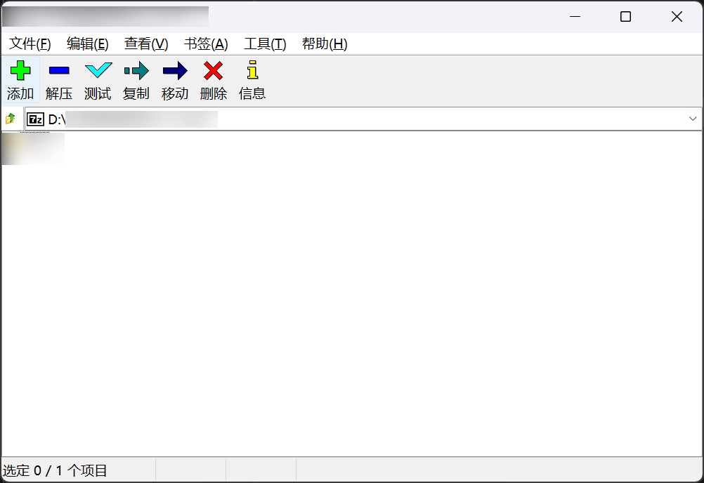
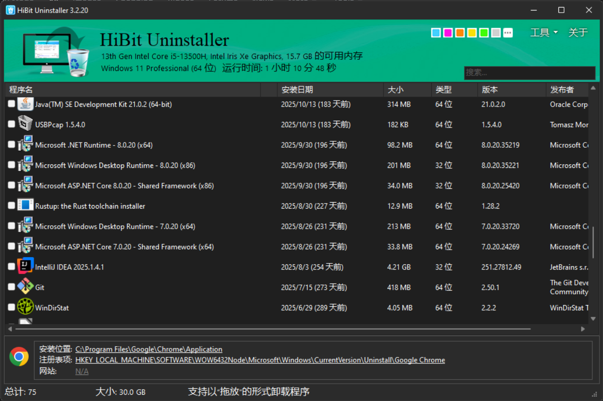
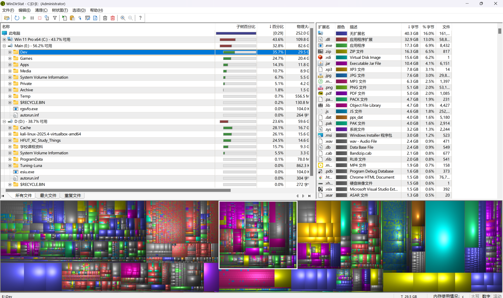
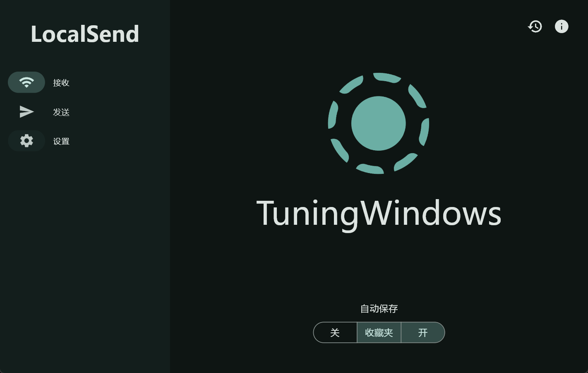
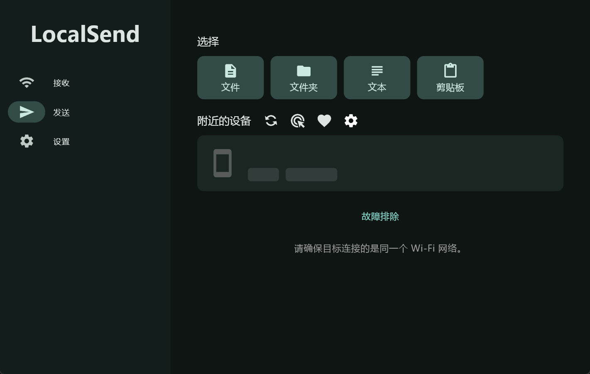
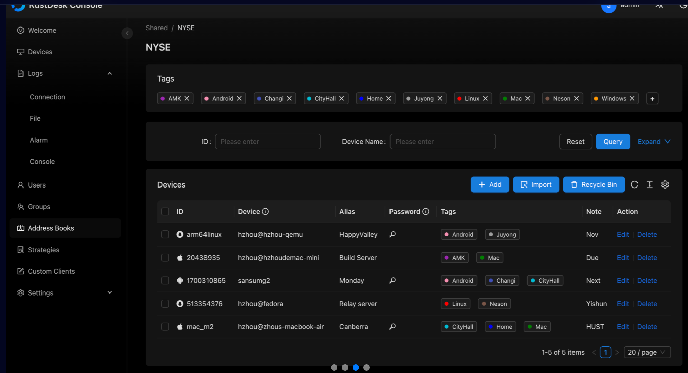
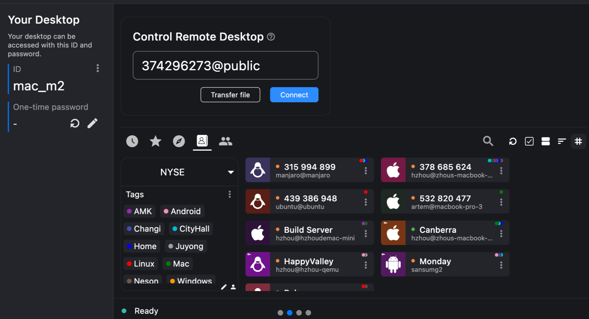
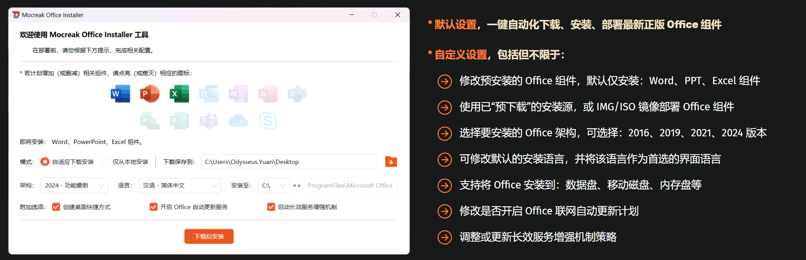

# My Awesome Tools

一个个人维护的工具合集仓库，主要收录我日常使用的高质量软件与工具。

## 📌 本仓库特点

本仓库收录的工具**基本满足**以下特性：

开源（Open Source）；免费（Free）；轻量（Lightweight）；无广告（Ad-free）；极简设计（Minimalist）

## 📚 目录

### Windows

（点击链接即可跳转）

- [Bitwarden](#bitwarden) ：密码管理器
- [Snipaste](#Snipaste) ：截图、标注和贴图工具
- [ShareX](#ShareX) ：截图，录屏工具。“截图界的瑞士军刀”
- [SumatraPDF](#SumatraPDF)：纯粹极简的PDF阅读器
- [ImageGlass](#ImageGlass)：纯粹的图片查看器
- [Everything](#Everything) ：快速文件搜索工具
- [Scrcpy](#Scrcpy)：用电脑控制手机（支持无线，USB）
- [7zip](#7zip)：极简压缩解压工具
- [HibitUninstaller](#HibitUninstaller) ： 软件卸载工具
- [WinDirStat](#WinDirStat) ：可视化磁盘空间分析工具
- [LocalSend](#LocalSend)：局域网文件传输工具
- [RustDesk](#RustDesk)：开源远程控制工具
- [Mocreak](#Mocreak)：Office全家桶一键激活工具
- [PiliNara](#PiliNara)：Bilibili第三方客户端

### Android

（点击链接即可跳转）

- [Bitwarden](#bitwarden) ：密码管理器
- [LocalSend](#LocalSend)：局域网文件传输工具
- [RustDesk](#RustDesk)：开源远程控制工具
- [PiliNara](#PiliNara)：Bilibili第三方客户端

## 📋 列表

### Bitwarden

- 官网：https://bitwarden.com/

开源透明 + 端到端加密安全性高，支持自部署

Chrome Extensions，Windows，Android数据通用，免费版功能还是很足的。

[⬆️ 返回顶部](#my-awesome-tools)

---

### Snipaste

- 官网：https://www.snipaste.com/

免费，最近好像改成买断制了。算是我使用很广泛的截图、标注和贴图于一体的高效工具吧，没有OCS功能

需要OCS的可以看看这个工具：[ShareX](#ShareX)

[⬆️ 返回顶部](#my-awesome-tools)

---

### ShareX

- 官网：https://getsharex.com/
- GitHub：https://github.com/ShareX/ShareX （36K Stars）

很强的一款开源的截图与录屏工具，支持自动上传、工作流定制和强大后处理。

功能非常非常全，“截图界的瑞士军刀”。

[⬆️ 返回顶部](#my-awesome-tools)

---

### SumatraPDF

- 官网：https://www.sumatrapdfreader.org/
- GitHub：https://github.com/sumatrapdfreader/sumatrapdf （16K+ Stars）

一款极致轻量的 PDF 阅读器，同时支持PDF, eBook (epub, mobi), comic book (cbz/cbr), DjVu, XPS, CHM等多种格式。

打开速度极快，占用资源极低，没有任何花里胡哨的功能，专注“阅读”本身。

[⬆️ 返回顶部](#my-awesome-tools)

---

### ImageGlass

- 官网：https://imageglass.org/
- Github： https://github.com/d2phap/ImageGlass （13K）

一款轻量且高性能的图片查看器，常见的图片格式都支持，本人感觉比Windows自带的好用，主要是我喜欢简洁，不喜欢太多功能

[⬆️ 返回顶部](#my-awesome-tools)

---

### Everything

- 官网：https://www.voidtools.com/support/everything/

伟大不必多言。毫秒级的文件搜索。支持正则表达式、实时搜索以及极低的系统资源占用。

[⬆️ 返回顶部](#my-awesome-tools)

----

### scrcpy

- 官网：https://scrcpy.org/
- GitHub：https://github.com/Genymobile/scrcpy （138K+ Stars）

开源的 Android 屏幕投射工具，支持通过 USB 或无线将手机画面实时投到电脑，并可直接用键鼠控制。

很方便，手机电脑什么软件都不用下载，打开就能用。

[⬆️ 返回顶部](#my-awesome-tools)

---

### 7zip

- 官网：https://www.7-zip.org/

极简的压缩解压工具，同时支持命令行操作，适合自动化脚本。

之前一直用Bandizip的，也很不错的软件，不过后来收费了就没再用。

这个7zip界面过于简单，如果需要美观的界面可以搜搜基于7zip的衍生版本，这里我就不做推荐了。

[⬆️ 返回顶部](#my-awesome-tools)

----

### HibitUninstaller

官网：https://www.hibitsoft.ir/Uninstaller.html

相比于普通的卸载器，可以更彻底清理注册表和残留文件，还支持强制卸载某个文件或者文件夹

[⬆️ 返回顶部](#my-awesome-tools)

---

### WinDirStat

- 官网：https://windirstat.net/

一款用于分析磁盘空间占用情况的工具，通过树状结构 + 彩色矩形图直观展示文件占用分布。

[⬆️ 返回顶部](#my-awesome-tools)

---

### LocalSend

- 官网：https://localsend.org/
- GitHub：https://github.com/localsend/localsend （78K Stars）

基于局域网的点对点文件传输，无需联网或中转服务器。

说真的，这个工具我非常非常喜欢，功能非常强大，主流操作系统全部支持，只要在同一个局域网下就可以互相传输，比你上QQ发文件快多了。

[⬆️ 返回顶部](#my-awesome-tools)

---

### RustDesk

- 官网：https://rustdesk.com/
- GitHub：https://github.com/rustdesk/rustdesk （111K Stars）

开源远程桌面控制，之前都用向日葵，UU，ToDesk，不过后续都收费了。而RustDesk依旧开源免费。支持自建服务器，主流操作系统都支持。如果没有自己的服务器，也可以用官方提供的服务器。

需要注意的官方服务器在中国禁止使用（仅限电脑控制手机，手机控制电脑不受影响）。原因在这里：https://github.com/rustdesk/rustdesk/discussions/7952。
想要避免就自建服务器。或者用我推荐的另一款工具：[Scrcpy](#scrcpy)

[⬆️ 返回顶部](#my-awesome-tools)

---

### Mocreak

- 官网：https://www.mocreak.com/
- GitHub：https://github.com/OdysseusYuan/LKY_OfficeTools （11K Stars）

“一键自动化、无人值守下载、安装、部署 Office 的利器”。我的Office就是这样激活的，就是傻瓜式操作，选择你需要的Office套件，然后安装就行了。

[⬆️ 返回顶部](#my-awesome-tools)

---

### PiliNara

- Github：https://github.com/Starfallan/PiliNara （300Stars）

是著名开源项目[PiliPala](https://github.com/guozhigq/pilipala) 的Frok，由于被B站发律师函了，故停止更新。这个PiliNara是从[PiliPlus](https://github.com/bggRGjQaUbCoE/PiliPlus) Frok过来的。最近也一直在更新，本人三端（Windows，Android，平板）都在使用，觉得这个Frok的使用体验不错，网页端的话，使用的是这个插件：[BewlyCat](https://chromewebstore.google.com/detail/bewlycat/oopkfefbgecikmfbbapnlpjidoomhjpl?hl=en-GB&utm_source=ext_sidebar)。

现在B站原版的体验真的不行了，建议整个这样的第三方，或者使用国际版（已经在Google Play下架，需要自己找到APK安装包下载，或者去我首页联系我，我发给你），或者使用插件/模块。

[⬆️ 返回顶部](#my-awesome-tools)

---

