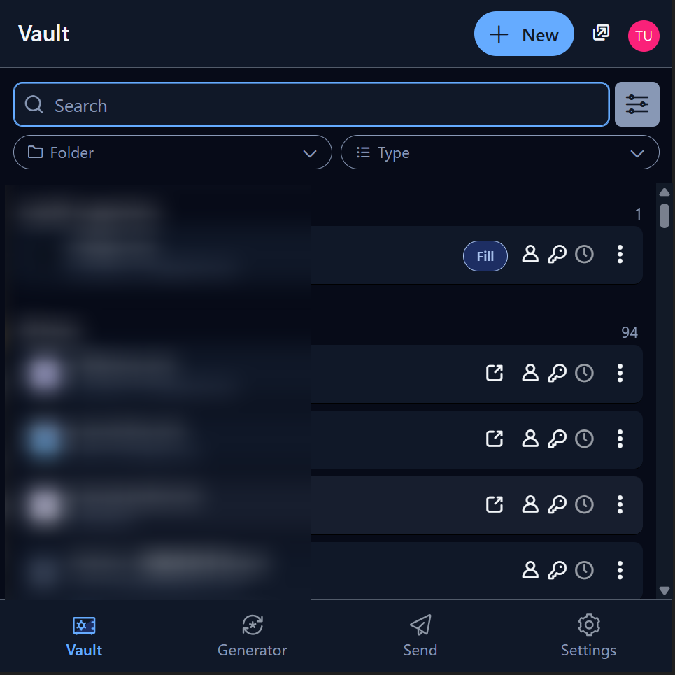
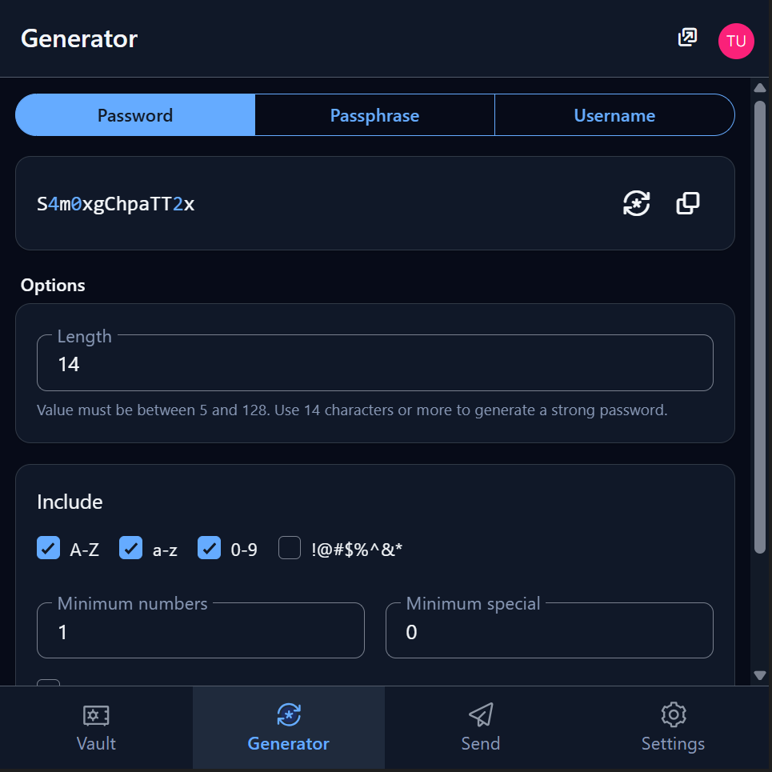
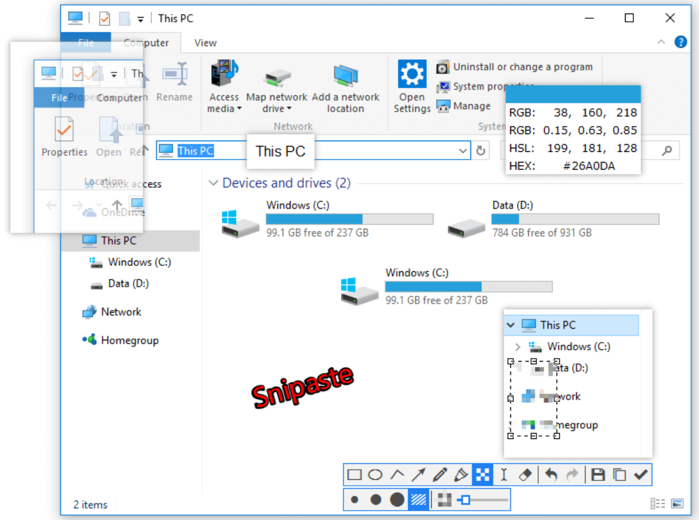
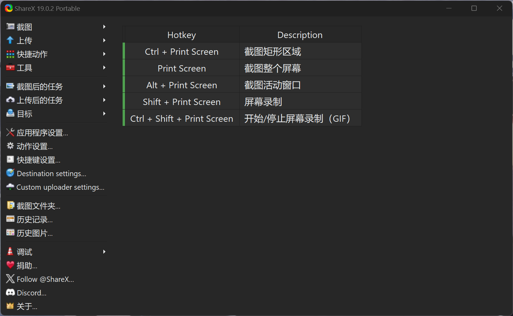
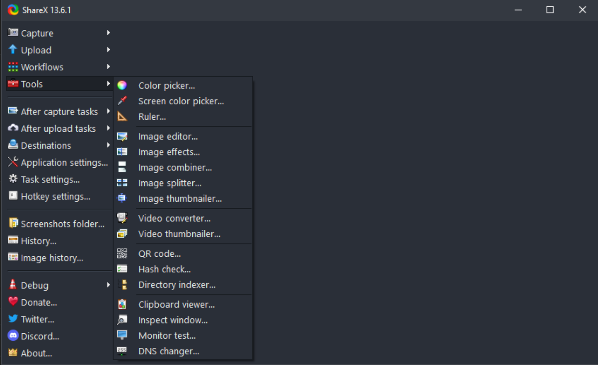
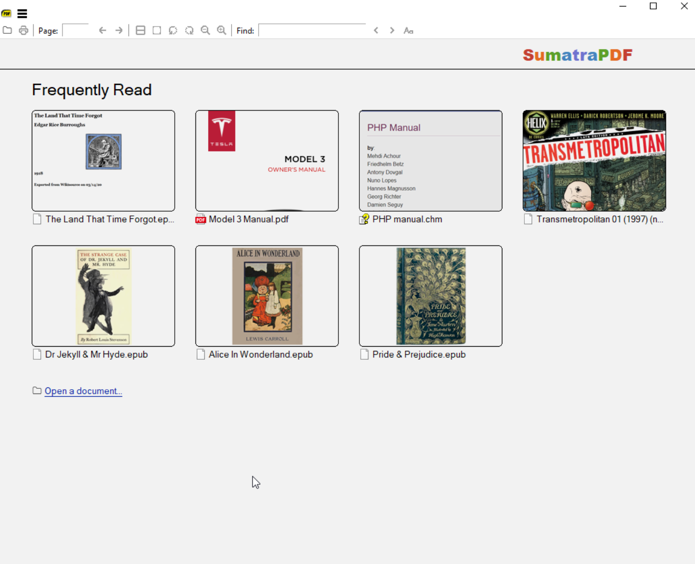
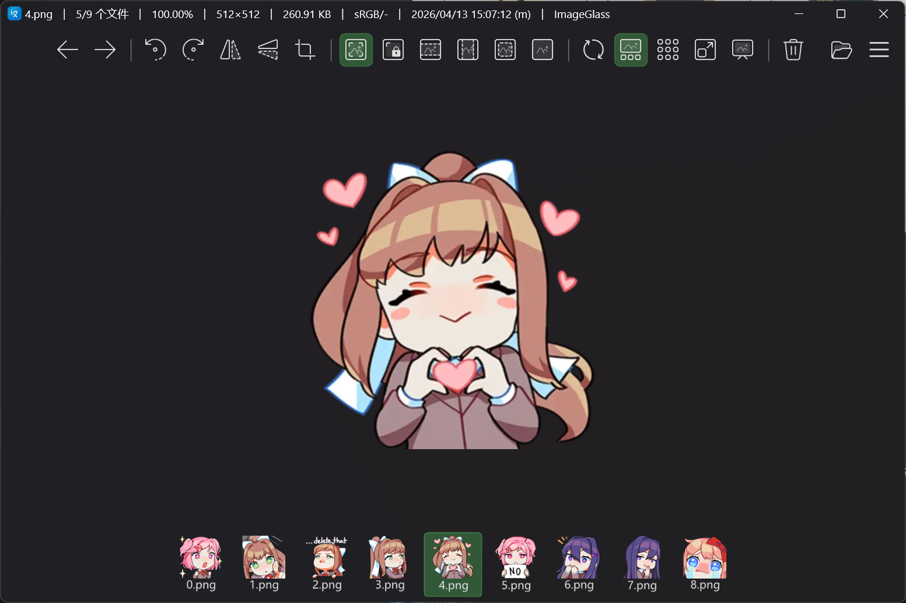
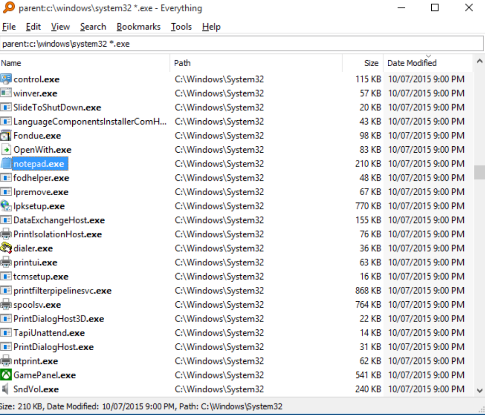
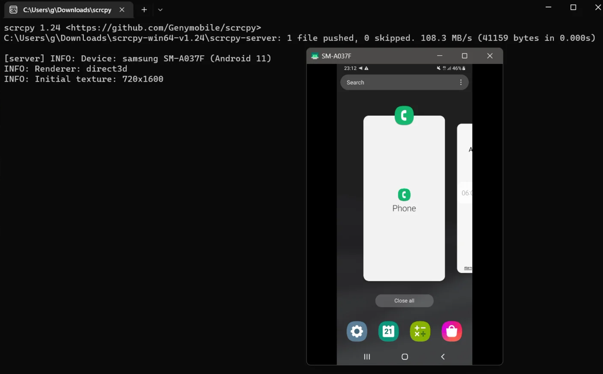

# My Awesome Tools

本人自己使用的软件，工具。

都至少符合开源，免费，轻量，无广告之一。

由于本人算半个Geek，喜欢折腾电脑，所以这类工具找的比较多，有时候突然想不起来了，故建立此仓库。方便自己记录，同时做出分享。

Windows端

（点击链接即可跳转）

- [Bitwarden](#bitwarden) ：密码管理器
- [Snipaste](#Snipaste) ：截图、标注和贴图工具
- [ShareX](#ShareX) ：截图，录屏工具。“截图界的瑞士军刀”
- [SumatraPDF](#SumatraPDF)：纯粹极简的PDF阅读器
- [ImageGlass](#ImageGlass)：纯粹的图片查看器
- [Everything](#Everything) ：快速文件搜索工具
- [Scrcpy](#Scrcpy)：用电脑控制手机（支持无线，USB）

Android端

（点击链接即可跳转）

- [Bitwarden](#bitwarden) ：密码管理器

----

### Bitwarden

- 官网：https://bitwarden.com/

开源透明 + 端到端加密安全性高，支持自部署

Chrome Extensions，Windows，Android数据通用，免费版功能还是很足的。

[⬆️ 返回顶部](#my-awesome-tools)

---

### Snipaste

- 官网：https://www.snipaste.com/

免费，最近好像改成买断制了。算是我使用很广泛的截图、标注和贴图于一体的高效工具吧，没有OCS功能

需要OCS的可以看看这个工具：[ShareX](#ShareX)

[⬆️ 返回顶部](#my-awesome-tools)

---

### ShareX

- 官网：https://getsharex.com/
- GitHub：https://github.com/ShareX/ShareX （36K Stars）

很强的一款开源的截图与录屏工具，支持自动上传、工作流定制和强大后处理。

功能非常非常全，“截图界的瑞士军刀”。

[⬆️ 返回顶部](#my-awesome-tools)

---

### SumatraPDF

- 官网：https://www.sumatrapdfreader.org/
- GitHub：https://github.com/sumatrapdfreader/sumatrapdf （16K+ Stars）

一款极致轻量的 PDF 阅读器，同时支持PDF, eBook (epub, mobi), comic book (cbz/cbr), DjVu, XPS, CHM等多种格式。

打开速度极快，占用资源极低，没有任何花里胡哨的功能，专注“阅读”本身。

[⬆️ 返回顶部](#my-awesome-tools)

---

### ImageGlass

- 官网：https://imageglass.org/
- Github： https://github.com/d2phap/ImageGlass （13K）

一款轻量且高性能的图片查看器，常见的图片格式都支持，本人感觉比Windows自带的好用，主要是我喜欢简洁，不喜欢太多功能

[⬆️ 返回顶部](#my-awesome-tools)

---

### Everything

- 官网：https://www.voidtools.com/support/everything/

伟大不必多言。毫秒级的文件搜索。支持正则表达式、实时搜索以及极低的系统资源占用。

[⬆️ 返回顶部](#my-awesome-tools)

----

### scrcpy

- 官网：https://scrcpy.org/
- GitHub：https://github.com/Genymobile/scrcpy （138K+ Stars）

开源的 Android 屏幕投射工具，支持通过 USB 或无线将手机画面实时投到电脑，并可直接用键鼠控制。

很方便，手机电脑什么软件都不用下载，打开就能用。

[⬆️ 返回顶部](#my-awesome-tools)

---

